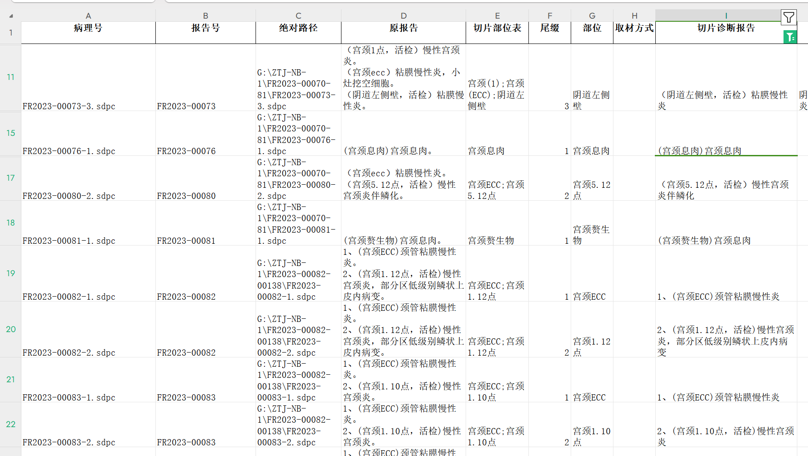

# nbxbb

#### 介绍
{**此方法适用于处理已完成百度OCR初步命名及调准正确命名顺序后的宁波小标本**
使用前请确保文件夹中的.sdpc文件名均为（或大多数为）“FR2023-xxxxx-X.sdpc”格式（其中x为数字，X为字符串），过程中会多次手动运用excel手动筛选数据。}

#### 代码解释

1. **生成表头.py**:遍历文件夹中所有以“FR”开头，“.sdpc”结尾的文件，将符合条件的文件名和路径保存为nb_able.xlsx，不符合条件的文件名和路径保存为nb_disable.xlsx
2. **生成尾缀.py**:将病理切片号拆分为病理号和尾缀，输出为病理号、报告号、尾缀
3. **删除重复行.py**：删除重复行
4. **bianhaoduiqi.py**:从子表的病理切片号中提取病理号,已子表的切片号为基准，将总表信息对应到子表，通过病理号匹配，将病理诊断和切片部位表对应到子表
5. **listed.py**:将病理按照符号进行拆分成多行形式（按照“**。**”）
6. **split_part.py**：根据尾缀号把部位对照表对应到具体切片部位
7. **切片诊断报告精准拆分.py**：读取需要填写的第一个文件的病理号和部位，并以病理号对应拆分多行后的第二个文件（读取病理号和病理诊断），根据第一个文件部位查找第二个文件中病理诊断中是否包含部位，并输出

#### 使用说明

1. 运行**生成表头.py**,手动筛选出含“，”、“；”及乱码的文件名删除并保存副本，生成切片名非乱码的子表
2. 运行**biaobenduiqi.py**,得到切片号对应的病理诊断和切片部位表,手动筛选出切片部位不为空的数据
3. 运行**生成尾缀.py**，得到病理切片号的病理号和尾缀，手动筛选尾缀，删除带括号以及空白项并保存副本，剩下的文件即为切片名完全正确的切片
4. 手动复制上一步输出文件的病理号和病理诊断，粘贴得到_1.xlsx_，运行**删除重复行.py**，将得到的输出**手动修改**后运行**listed.py**，得到拆分后的病理报告，并删除空行
5. 运行**split_part.py**，根据尾缀号把切片对应表对应到具体切片部位
6. 运行**切片诊断报告精准拆分.py**，得到最后的表形如

#### 库中xlsx文件的输入输出均为原始文件，可参考输入输出更改
